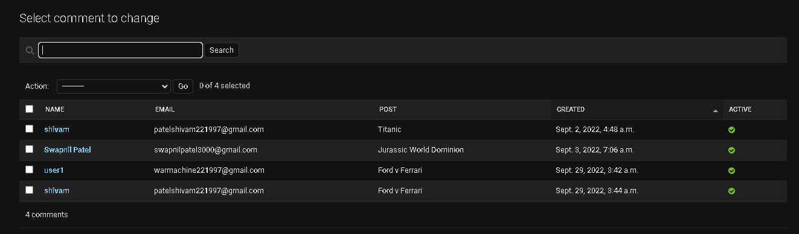

Django Blog | A Blog Application 
================================

> django_blog is a blog application where users can read, share and comment on blog posts. In addition to features offfered by a basic blog application this application implements several bakend features which make this application highly reliable and scalabe. As a part of implementation of this projects following features/outcomes/learnings have been targeted -     

- Build data models, views, and URLs
- Implement an administration site for blog
- Use canonical URLs for modles and implement SEO-friendly URLs for posts
- Build post pagination and learn how to create class-based views
- Use forms to allow readers to share posts via email and implement a comment system using model forms
- Add tags to posts using [django-taggit](https://github.com/jazzband/django-taggit) and recommend similar posts based on shared tags
- Implement custom template tags to display latest posts and most commented posts
- Implement a custom template filter to render [Markdown](https://github.com/Python-Markdown/markdown)
- Create a sitemap and a RSS feed for blog
- Implement a full-text search engine using PostgreSQL
- Implement a Filter/navigation bar for ease of navigation and search.

Home page
---------

The home page of the application displays the list of blog posts along with headline of blog and a few eye catching attributes related to the blog. **Pagination** has been implemented over the listing view to restrict only 3 blogs per page to improve page performance and load times. 

There is a **navigation bar** on the left side of the window with quick access to **RSS feed, full text search, most commented posts and recent posts**. The number of posts listed under each headings can be easily managed with minimal code change.

A **filter bar** (based on the attributes of a post) has been integrated with the navigation bar to allow users to filter the post list as per needs.

Here is how the home page looks like - 

Home - https://djblogsite.herokuapp.com/blog/

Tagging system
--------------

Each blog posts in the application are tagged with a tag representing the type of the post *(in our scenario- genere of the movie)*. The tagging system allows the posts to be grouped on the basis of the tags. Using this idea the **search by tag** feature is implemented wherein user can filter the blogs by tags. Tagging system is also used to list the **similar posts** related to a post on post detail page.

Comment system
--------------

The comment system allows users to add comment/reviews on the post which can be later reviewed by the blog admin. The blog admin can set the comment as inactive if found to be inappropriate.

Share posts
-----------

Using the share feature, the users can invite other users to the blogsite to read interesting posts found by them. **Gmail SMTP** has been used to implement this feature.

Full text search
----------------

Using the capabilities and features of **postgres**, a full text search engine has been implemented in this application. This feature allows users to search anything over the application database. Query weighing and trigram search have been considered as a part of future scope.

RSS feed
--------

To allow users to stay up-to-date with new content posted on the application, a RSS feed has been integrated into this application using django syndication framework. This allows users to get informed whenever a new post has been added to blog(without asking the user to subscribe to application).

RSS feed - https://djblogsite.herokuapp.com/blog/feed/

Site map
--------

A Sitemap has been included to allow web crawlers and search engines to priortise some important pages of the application over the other.

Sitemap - https://djblogsite.herokuapp.com/sitemap.xml/

Credits
=======

- Django 4 by example - [github](https://github.com/PacktPublishing/Django-4-by-example)
- [django-taggit](https://github.com/jazzband/django-taggit)
- [Markdown](https://github.com/Python-Markdown/markdown)
- [Django](https://github.com/django)
- [Heroku cloud application platform](https://www.heroku.com/home)